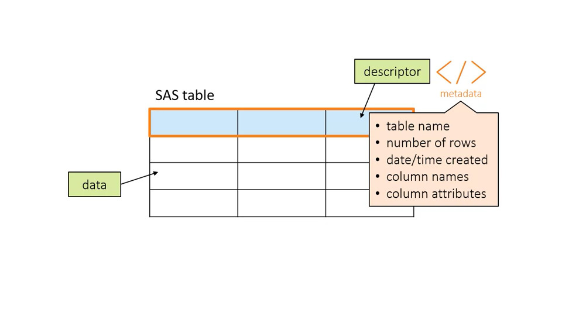
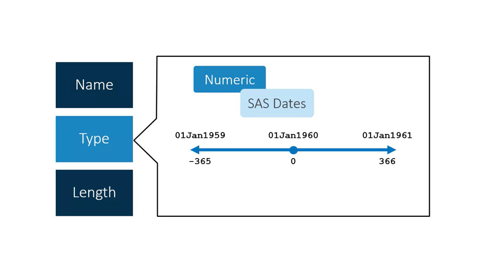

<!-- <script async src="https://cse.google.com/cse.js?cx=1b2b03e5a2263e108"></script>
<div class="gcse-search"></div> -->

## Accessing Data

## Overview

Accessing data is the first step in the SAS programming process. Data can come from a variety of locations and in many formats. It could be structured or unstructured. It might be SAS data, a Microsoft Excel file, or something else. In this section, we will learn to identify the features of a SAS table, access data through libraries, and import data into SAS.

## Understanding SAS

### Types of Data

Data can be broadly specified into 2 categories -

- **Structured data or table**: It has defined columns with attributes. It includes SAS tables, Microsoft Access tables, DBMS tables such as Oracle or Teradata, Hadoop, and many other options.
- **Unstructured data**: It does not have defined columns. The data might appear to be in columns,
such as tab-delimited data, but to the computer it's just a long string of text. Examples of unstructured data are text files or comma-delimited files, JSON files, and weblogs. There is important information in these files, but it's not in a defined structure. One needs to import unstructured data into SAS before analyzing or reporting on it.

### SAS Table

A SAS table is a structured data file that has defined columns and rows. SAS tables have the file extension `.sas7bdat`. There are two parts to a SAS table - 

- a descriptor portion: contains metadata or the properties of the table such as the name, the number of rows, and the date and time the table was created; it also includes column names and attributes
- the data portion: contains the data values stored in columns.

In SAS terminology, a table is also called a dataset, a column is also called a variable, and a row is also called an observation. These terms are interchangeable.



<figcaption>Parts of a SAS table</figcaption>

### Required Column Attributes of SAS Tables

A column must have 3 attributes

- Name:
    - Column names
    - 1-32 characters long
    - Starts with letter or underscore
    - Continues with letters, numbers or underscores
    - Uppercase, lowercase or mixed case
    - Once create they can referenced case-insensitively
    - Same naming convention should be followed for SAS table names
- Type
    - 2 types of type in SAS - Numeric and Character

    **Numeric and Character Column**

    Numeric | Character
    --------|----------
    digits 0 to 9 | letters
    minus sign | numbers
    decimal point | special characters
    scientific notations (the power of 10, E) | blanks
    missing value denoted by a period | missing value denoted by a space

    SAS dates are particular kind of numeric value. They are stored as number of days passed after 01 Jan, 1960. Dates before them are stored as negative values. 

    

    <figcaption>SAS Dates</figcaption>

    This way of storing date values makes calculations and sorting possible.

    - Length
        - Numeric
            - 8 bytes (~16 significant digits)
        - Character
            - 1 - 32,767 bytes (1 byte = one character)
            - Length should be the number of letters of the longest word of the column. For example, a column such as Country Code that contains two-letter codes might have a length of 2. A column such as Country Name that stores the full names of countries must have a length at least as long as the longest country name.

    ### Question 2.01

    Q: Which column names are valid? Select all that apply

    A: month6, Month6, month_6 (month#6 → contains special character #, month 6 → contains space, 6month → starts with a number)

    ### Activity 2.02

    Q: If necessary, [start SAS Studio](http://dl.liveweb.sas.com/eldata/start_SAS_Studio.htm).

    1. Expand **Files and Folders** and navigate to the location of your course files. Open the **data** folder.
    2. Double-click the **storm_summary** SAS table to view it. Notice that missing character values are stored as a
    space and missing numeric values are stored as a period.
    1. Click the **Table Properties** tool above the **storm_summary** data to view the table and column attributes. Examine the length of the **Basin** column.

    Could *East Pacific* be properly stored as a data value in the **Basin** column?

    A: No (Length of the Basin column is 2 bytes, so the East Pacific would be truncated and only Ea will be stored).

    ### Listing Table and Column Attributes

    We can use `proc contents` to list table and column attribute.

    Syntax:

    ```sas
    PROC CONTENTS DATA=data_set
    RUN;
    ```

    ### Activity 2.03

    Q: If necessary, [start SAS Studio](http://dl.liveweb.sas.com/eldata/start_SAS_Studio.htm).

    1. In a new program window, write a PROC CONTENTS step to generate a report of the **storm_summary.sas7bdat** table. Be sure to specify the path to your **EPG194/data** folder and the full name of the table.
    2. Run the program.

    How many observations (rows) are in the table? **Note**: Type a number for your answer.

    A: 3118

    ```sas
    proc print data="/home/user_id/EPG194/data/storm_summary.sas7bdat";
    run;
    ```

    Q: How is the table sorted?

    A: The table is sorted by **Season, Name**

## Accessing Data through Libraries

### Accessing Data in a Program

So far, we have used hardcoded file path to the SAS dataset. However, it causes some issues -

- To write a longer more complex program, it would be tedious to
have to repeatedly provide the full name and file path each time.
- If the data changes locations we have to edit the program in multiple places.
- If the type of data we want to read is Excel or Teradata, providing a simple file path to those files won't work.
- SAS needs more specific instructions to read other types of structured data.

We can solve these issues using Libraries.

### Using a SAS Library to Read SAS Data

One can think of a library as a collection of data files of same type and they reside in same location.

- Syntax: `LIBNAME libref engine :path"`

`libref` is the name of the library:

- it must be ≤ 8 characters
- starts with letter or underscore
- continues with letters, numbers or underscores

`engine` is the name of the behind-the-scenes set of instructions. There are different types of engines for different data types (Base for SAS tables, Excel, Teradata, Hadoop, etc.).

`path` relative to where SAS is running.

LIBNAME is a global statement and does not need a run statement at the end.

Example:

`libname mylib base "s:/workshop/data";`

Base is the default engine and can be omitted - `libname mylib "s:/workshop/data";`

We can reference a table in the library using dot (.) operator: `libref.table_name`

```sas
proc contents data=mylib.class;
run;
```

The libref is simple a pointer or shortcut to existing data, and it remains until we delete it or end the SAS session. We can delete the library reference by: `libname mylib clear` .

### Activity 2.04

Q: If necessary, [start SAS Studio](http://dl.liveweb.sas.com/eldata/start_SAS_Studio.htm).

1. Open a new program window in SAS Studio. Write a LIBNAME statement to create a library named **PG1** that reads SAS tables in the **EPG194/data** folder. If you are not sure of the path to your data folder, right-click the **data** folder in the navigation pane and select **Properties**. You can copy the path shown there.
2. Run the code. After the code runs, you should see a note in the log that the library was successfully assigned.
3. Select the **Code** tab. Save your program as **libname.sas** in the **EPG194** folder. You can replace the file if it already exists.
4. Select **Libraries** in the navigation pane and expand **My Libraries**.
5. Expand the **PG1** library and view the list of SAS tables.

Why are the Excel and text files in the data folder not included in the library?

A: The library is for SAS files.

```sas
libname PG1 base "/home/user_id/EPG194/data";
```

### Automatic SAS Libraries

When a SAS session is created, several libraries are automatically created by SAS.

- One of them is `work` , a temporary library, which is automatically defined at the beginning of the session.  It is temporary because any tables written to the work library are deleted at the end of each SAS session. This library is commonly used in SAS programs because it's a great way to create working files that don't need to be saved permanently. The work library is also the default library, if a `libref` is not mentioned in front of a table name SAS uses the work library.

```sas
data=work.test
data=test
```

Both of them refers to a temporary table `test` under the `work` library.

- Another one is `Sashelp`.Sashelp contains a collection of sample tables and other files.
- SAS Administrator can also establish other libraries in the SAS environment.

## Importing Data Into SAS

Libraries are a very efficient and elegant way to directly access structured data and use it in a program. However, sometimes we need to access unstructured data. In order to do that, we must import the data into a structured format such as a SAS table before the data can be used in a program.

### Importing Unstructured Data

#### Import Procedure

`PROC IMPORT` reads data from an external data source and writes it to a SAS data set.

```sas
PROC IMPORT DATAFILE="path/filename" DBMS=filetype
						OUT=output-table;
RUN;
```

We can use -

- **DATAFILE** equal option to provide the path and complete filename
- **DBMS** equal option to define the file type and
- **OUT** equal option to provide the library and name of the SAS output table that wewant to create.

By default, SAS assumes column names are found in the first row of the file.

#### Extra Options

```sas
PROC IMPORT DATAFILE="path/filename" DBMS=filetype
	    OUT=output_table <REPLACE>;
	<GUESSINGROWS=n|MAX;>
RUN;
```

We can use -

- **REPLACE** option to overwrite the SAS output table if it already exists.
- By default, SAS scans the 20 rows of the data to make its best guess for the column attributes including type and length. It's possible that SAS might incorrectly assume a columns type or length based on the values found in those initial rows. We can use the **GUESSINGROWS** equal option to provide a number of rows to examine. We can also use the keyword **MAX** to examine all rows. SAS scans the number of rows that is specifies to determine the type and length of each column in the table.

## Demo: Importing a Comma-Delimited (CSV) File

We can use the following proc import procedure to import a CSV file:

```sas
proc import datafile="s:/workshop/data/storm_damage.csv" dbms=csv
						out=storm_damage_import replace;
run;

proc contents data=storm_damage_import;
run;
```

### Importing an Excel File

We can use the XLSX library engine to read and write Excel data directly. However, to import Excel data as a SAS table (requires SAS/ACCESS to PC files licensed):

```sas
PROC IMPORT DATAFILE="path/file-name.xlsx" DBMS=XLSX
						OUT=output-table <REPLACE>;
		SHEET=sheet-name;
RUN;
```

By default, SAS reads the first worksheet.

For example:

```sas
proc import datafile="s:/workshop/data/class.xlsx"
			dbms=xlsx
			out=work.class_test_import replace;
		sheet=class_text;
run;
```

XLSX engine vs PROC IMPORT;

XLSX Engine:

- reads directly from Excel file
- data is always current

PROC IMPORT:

- creates copy of Excel file
- data must be reimported if it changes
