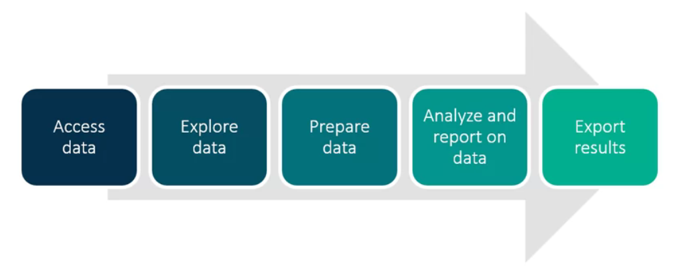
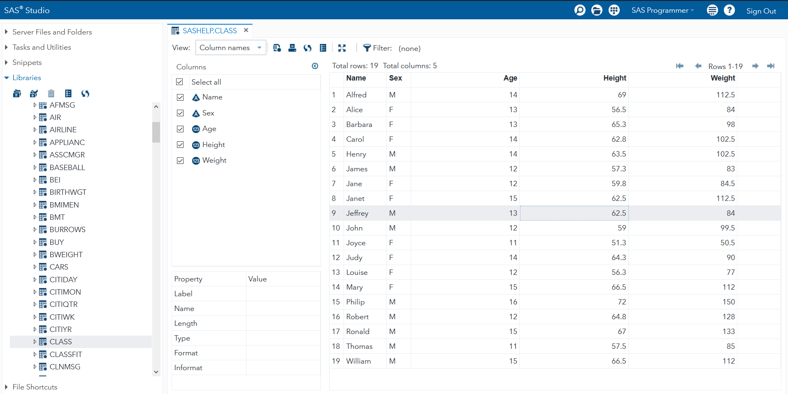
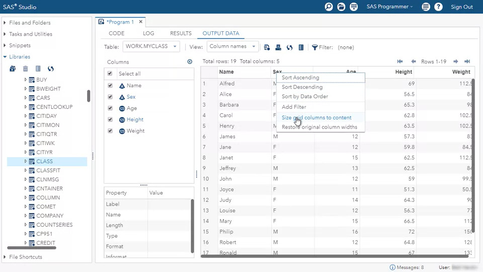
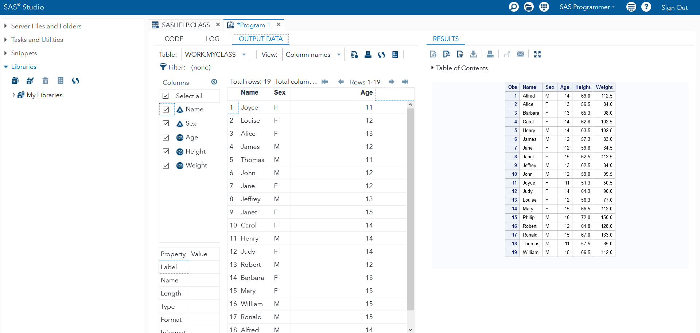
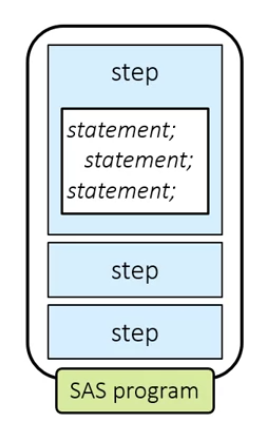

*This is first in a series of notes as I go through the course: [Getting Started with SAS Programming](https://www.coursera.org/learn/sas-programming-basics).*

# Welcome

## Welcome to the Course!



_Fig. Steps to make data meaningful and accessible_

To make data meaningful and accessible:

- **access data** or read it with a program
- **explore the data** to see what's there what you might need to add or change
- **prepare the data** for analysis
- **analyze and report on the data**
- **export results** to various report and data formats.

## Choosing and Setting Up SAS Software for this Course

SAS Studio can be practiced in 2 ways -

- [SAS OnDemand for Analytics](http://support.sas.com/software/products/ondemand-academics/): Nothing to download, runs on cloud.
- [SAS University Edition (vApp)](http://support.sas.com/software/products/university-edition/index.html):  Need to download a software, runs offline.

## Setting Up Practice Files

- [Follow these step-by-step instructions to set up your course practice files in SAS OnDemand for Academics](http://dl.liveweb.sas.com/eldata/setupPG1_oda_coursera.htm)
- [Follow these step-by-step instructions to set up your course practice files in SAS University Edition](http://dl.liveweb.sas.com/eldata/setupPG1_ue_coursera.htm)

# Using SAS Programming Tools

## SAS Programming Interfaces

SAS has several programming interfaces that one can use to write and submit code:

- SAS Studio
- SAS Enterprise Studio
- SAS Windowing Environment

In this course, we'll be using SAS studio.

SAS studio contains 4 tabs

- **Editor** to write and submit code
- **Log** to view messages from SAS
- **Results**, and
- **Output Data** to view results

To make programming much easier the editor contains - code completion, formatting and syntax coloring.

## Programming with SAS Studio

We can use the navigation pane on the left to access data in different folders.

SAS contains few reference. Let us open the CLASS table: Libraries → My Libraries → SASHELP → CLASS. Double clicking `CLASS` opens the table in the data grid.



_Fig. CLASS table opened in SAS_

- On the left side, we have a panel that summarizes the columns and their attributes which can be minimized by clicking the left arrow button.
- Let us write a new program to analyze the data. A new tab can be opened by pressing `F4` or by Options → New SAS Program.

```sas
/* Reads SASHELP.CLASS tablereads that SASHELP.CLASS table
and creates a copy called myclass. */
data myclass;
	set sashelp.class;
run;

/* Prints what in MYCLASS table */
proc print data=myclass;
run;
```

Clicking on run (or pressing `F3`) creates `RESULT`.

- In the LOG tab, we can observe the notes. Since the program ran successfully we do not see any Errors or Warnings.
- RESULTS includes the report that was created for the new MYCLASS table.
- OUTPUT DATA displays the new table created: MYCLASS.

To remove the extra space in the columns, we can right-click on any of the columns and choosing `Size grid columns to content`.



_Fig. Size grid columns to content_

To keep this setting always in effect: Choose `more application options` on the top bar → Preferences → Size grid columns to content → Save.

To run a selected portion of code: Select the portion of the code → Click on Run (or press `F3`).

The screen can be split into two halves by clicking the tab name (LOG or RESULTS or OUTPUT DATA ) and then dragging it into the left part of the screen. To unsplit simply click the tab name and drag it back to the original place (left half).



_Fig. Split Screen_

## Practice: Exploring SAS Studio

[PDF](https://d3c33hcgiwev3.cloudfront.net/KKYuHZQpEemX8g5wksC5BA_9125778769af4779ac8d98c3df3bd4d0_exploring_SAS_Studio.pdf?Expires=1602720000&Signature=ILf12f32TUtfhsNvzeD6IXVDM1--X-MDIYmg8pNR4LNTqn-dOoHrKebR4UW~cocVq0Y2xnuj-9y~iMMMsPeQXsrmZw5QGqt2C2Y8ZlrW8-xzToufdBl52XdXdWMg1Rc4w7euIlFpUxzkAMVrgrLZNszXBj1pGlRTkQzOxPp~i7I_&Key-Pair-Id=APKAJLTNE6QMUY6HBC5A).

# Understanding SAS Syntax

## SAS Program Structure

SAS programs consist of a number of steps. There are 2 types of steps: PROC step (procedure) and DATA step. A step generally ends with a `run` statement (some `proc` steps also ends with `quit` statement). If a `run` statement is not specified the beginning of `proc` or `data` keyword signals `run` statement of previous step.

```sas
data myclass;
	set sashelp.class;
	heightcm = height * 2.54;
run;

proc print data=myclass;
run;

proc print data=myclass;
	var age heightcm;
run;

```

The above program contains 3 steps - 1 DATA and 2 PROC steps.

A DATA step generally reads data from an input source, processes it, and creates a SAS table.  A DATA step might also filter rows, compute new columns, join tables, and perform other data manipulations. In this program, the DATA step is creating an output table and adding a new column.

A PROC or procedure step processes a SAS table in a specific a predefined way. In this program, the proc print step generates a list of all the rows and columns in the data, and the proc means step calculates basic summary statistics - Number (N), Mean, Standard Deviation, Maximum and Minimum.



_Fig. Step consists of Statements_

Statements must finish with a semicolon (;). A SAS program can also contain global statements - TITLE, OPTIONS, LIBNAME. They reside outside of the proc and data steps and do not need a run statement after them.

## Activity 1.01

Open the file `activities/p101a03.sas`.

```sas

data mycars;
	set sashelp.cars;
	AvgMPG=mean(mpg_city, mpg_highway);
run;

title "Cars with Average MPG Over 35";
proc print data=mycars;
	var make model type avgmpg;
	where AvgMPG > 35;
run;

title "Average MPG by Car Type";
proc means data=mycars mean min max maxdec=1;
	var avgmpg;
	class type;
run;

title;
```

Q: How many steps are in the program?

A: 3 (1 DATA and 2 PROC).

Q: How many statements are in the PROC PRINT step?

A: 4 (PROC, VAR, WHERE, and RUN).

Q: How many global statements are in the program?

A: 3 (TITLE)

Q: Run the program and view the log. How many observations (rows) are read by the PROC PRINT step?

A: 11

## SAS Program Syntax

- Spacing doesn't matter in SAS code. However, consistent program spacing is a good practice to make programs legible.
- Unquoted values can be lowercase, upper case, or mixed case.
- To comment out multiple lines of code use: `/* comment... */` and add `*`to comment out a statement. We can comment using `Ctrl + /`.

## Understanding SAS Program Syntax

Consider the following code:

```sas
data mycars; set sashelp.cars;
	AvgMPG=mean(mpg_city, mpg_highway);
run;
title "Cars with Average MPG Over 35";
proc print data=mycars;
var make model type avgmpg;
where AvgMPG > 35; run;
title "Average MPG by Car Type";
proc means data=mycars 
mean min max maxdec=1; 
var avgmpg;class type;
RUN;TITLE;
```

Even though it runs successfully, it is not properly indented and thus makes it harder to understand. We can use the `format code` button to format a code (proper spacing).

```sas
data mycars;
	set sashelp.cars;
	AvgMPG=mean(mpg_city, mpg_highway);
run;

title "Cars with Average MPG Over 35";

proc print data=mycars;
	var make model type avgmpg;
	where AvgMPG > 35;
run;

title "Average MPG by Car Type";

proc means data=mycars mean min max maxdec=1;
	var avgmpg;
	class type;
RUN;

TITLE;
```

## Finding and Resolving Syntax Errors

Common syntax errors: unmatched quotes, missing semicolons, misspelled keywords, and invalid options. Syntax errors might result in a warning or error in the log.

During running the code, SAS corrects misspelled keywords (daat → data or prco —> proc).

```sas
/* data misspelled */
daat mycars;
	set sashelp.cars;
	AvgMPG=mean(mpg_city, mpg_highway);
run;

title "Cars with Average MPG Over 35";
/* missing semicolon */
proc print data=mycars
	var make model type avgmpg;
	where AvgMPG > 35;
run;

title "Average MPG by Car Type";
/* we cannot use average, mean can be used instead */
proc means data=mycars average min max maxdec=1;
	var avgmpg;
	class type;
run;

title;
```

Consider the above code. There are 3 syntax errors (commented). We can run the code and observe the log.

- SAS assumes that `daat` is misspelled of `data` and runs successfully
- SAS suggests that we can use semicolon (along with some more options) before `var`
- SAS says that `average` is not expected and suggests a number of keywords

Let's fix the errors.

```sas
data mycars;
	set sashelp.cars;
	AvgMPG=mean(mpg_city, mpg_highway);
run;

title "Cars with Average MPG Over 35";

proc print data=mycars;
	var make model type avgmpg;
	where AvgMPG > 35;
run;

title "Average MPG by Car Type";

proc means data=mycars mean min max maxdec=1;
	var avgmpg;
	class type;
run;

title;
```

The above code runs successfully without any errors or warnings.

## Activity 1.02

Q: Open **p101a04.sas** from the **activities** folder and perform the following tasks:

1. Format the program to improve the spacing. Notice that a syntax error is detected. Fix the error and run the program.
2. Read the log and identify any additional syntax errors. Correct the syntax errors and format the program again.
3. Add a comment to describe the changes that you made to the program.
4. Run the program and examine the log and results.

How many rows are in the **canadashoes** data?

A:

Original code:

```sas
data canadashoes;
	set sashelp.shoes;
	where region="Canada;
	Profit=Sales-Returns;
run;

porc print data=canadashoes;
run;
```

Fixed code:

```sas
data canadashoes;
	set sashelp.shoes; /* missing semicolon */ 
	where region="Canada"; /* unbalanced quote */
	Profit=Sales-Returns;
run;

proc print data=canadashoes; /* misspelled proc */
run;
```

## Quiz

1. How many steps does this program contain?

```sas
data national;
    set sashelp.baseball;
    BatAvg=nHits/nAtBat;
run;

proc contents data=national;
run;

proc print data=national;
run;

proc means data=national;
    var BatAvg;
run;
```

A: 4 (1 data, 3 proc).

2. Running a SAS program can create which of the following? Select all that apply.

A: log, output data, results

3. Which of the following is a SAS syntax requirement?

A: End each statement with a semicolon

4. Which of the following steps is typically used to generate reports and graphs?

A: PROC

5. Does this comment contain syntax errors?

```sas
/*
Report created for budget
presentation; revised October 15.
  */
proc print data=work.newloan;
run;
```

A: No, the comment is correctly specified.

6. What result would you expect from submitting this step?

```sas
proc print data=work.newsalesemps
run;
```

A: An error message in the log (semicolon missing).

7. What happens if you submit the following program?

```sas
porc print data=work.newsalesemps;
run;
```

A: SAS assumes PROC is misspelled and executes the step.

8. This program contains a syntax error because National is in different cases.

```sas
data national;
    set sashelp.baseball;
    BatAvg=nHits/nAtBat;
run;

proc means data=NATIONAL;
    var BatAvg;
run;
```

A: No. (unquoted values are case-insensitive).

9. How many statements does this program contain?

```sas
*Create a cars report;

title "European Cars Priced Over 30K";
footnote "Internal Use Only";

proc print data=sashelp.cars;
    where Origin='Europe'
          and MSRP>30000;
    var Make Model Type
        Mpg_City Mpg_Highway;
run;
```

A: 6
