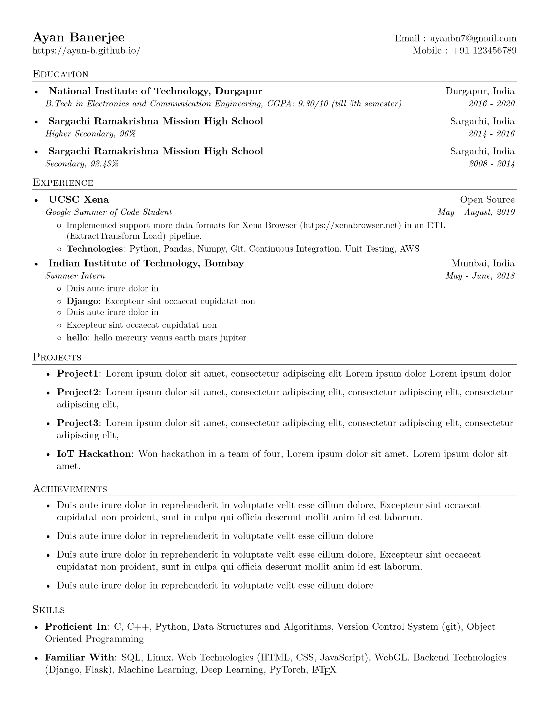

How about creating a LaTeX resume without even learning LaTeX!? Check out my project [resume generator](https://github.com/ayan-b/resume-generator) 🎉! Here you can create a LaTeX resume by simply changing the [data](https://github.com/ayan-b/resume-generator/blob/master/config/data.yml). For detailed instructions please see the README file 📝. The current template is based on [sb2nov resume](https://github.com/sb2nov/resume) which has over 1.6k ⭐ on GitHub.

The obtained resume will look something like this:

Please let me know if something is not clear in the README or if you want me to add any other features. Thank you! ❤️

_This post originally appeared on [Dev](https://dev.to/ayanb/generate-a-latex-resume-in-minutes-45hb)_.
